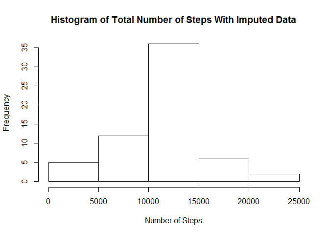

# Reproducible Research: Peer Assessment 1


## Loading and preprocessing the data

```r
# unzip data file
unzip("activity.zip")
proj.data <- read.csv("activity.csv")
```

## What is mean total number of steps taken per day?

```r
sum.data <- aggregate( cbind(steps) ~ date, data=proj.data, FUN=sum)
hist(sum.data$steps, xlab="Number of Steps", main="Histogram of Total Number of Steps")
```

 

```r
mean.val <- mean(sum.data$steps)
mean.val.out <- format(mean.val, scientific= FALSE, digits=6)
```

### Mean steps per day is: 10766.2 steps.

### Median steps per day is: 10765 steps.


## What is the average daily activity pattern?

```r
mean.data <- aggregate( cbind(steps) ~ interval, data=proj.data, FUN=mean)
plot(mean.data$interval, mean.data$steps, type="l", xlab="Interval", ylab="Mean number of steps")
```

 

```r
#find location of max
row.num <- which.max(mean.data$steps)
```

### The 5-min interval with the highest average number of steps is 835.


## Imputing missing values

### Total number of missing values in the data set is 2304.


```r
#put the average number of steps in for each interval with NA data
na.data <- proj.data
#match the big data set with the steps from the 'mean steps' data set and create
#a new column with the average numbers of steps for each interval
na.data$avg <- mean.data$steps[match(na.data$interval, mean.data$interval)]
#replace na with the average number of steps for that interval for each NA value
na.data$steps[is.na(na.data$steps)] <- na.data$avg[is.na(na.data$steps)]
#create a histogram with the imputed values
sum2.data <- aggregate( cbind(steps) ~ date, data=na.data, FUN=sum)
hist(sum2.data$steps, xlab="Number of Steps", main="Histogram of Total Number of Steps With Imputed Data")
```

 

```r
mean2.val <- mean(sum2.data$steps)
mean2.val.out <- format(mean2.val, scientific= FALSE, digits=6)
median2.val <- median(sum2.data$steps)
median2.val.out <- format(median2.val, scientific=FALSE, digits=6)
mean.abs <- abs(mean2.val-mean.val)
median.abs <- abs(median(sum2.data$steps) - median(sum.data$steps))
```

### Mean steps per day WITH IMPUTED VALUES is: 10766.2 steps.

### Median steps per day WITH IMPUTED VALUES is: 10766.2 steps.

### The difference between means is 0 steps.
### The difference between medians is 1.1886792 steps.

It looks like there was no impact to the means between the 2 data sets.  The median was impacted however.


## Are there differences in activity patterns between weekdays and weekends?


```r
#add weekend and weekday columns to na.data data frame
weekday.vec <- c("Monday", "Tuesday", "Wednesday", "Thursday", "Friday")
# see if day of the week is a week day
na.data$day.type <- 
  ifelse(weekdays(as.Date(na.data$date, format="%Y-%m-%d")) %in% weekday.vec, "weekday", "weekend")
library(lattice)
# change to factor
na.data <- transform(na.data, day.type = factor(day.type))
# get the means of the interval data
mean2.data <- aggregate( cbind(steps) ~ interval + day.type, data=na.data, FUN=mean)
xyplot(steps ~ interval | day.type, data=mean2.data, type="l", layout = c(1, 2),
       xlab="Interval", ylab="Mean Number of Steps")
```

 
